# Face-Detection-and-Facial-Expression-Recognition

<!-- PROJECT SHIELDS -->
[![Contributors][contributors-shield]][contributors-url]

[![MIT License][license-shield]][license-url]

<!-- TABLE OF CONTENTS -->
## Table of Contents

- [Face-Detection-and-Facial-Expression-Recognition](#face-detection-and-facial-expression-recognition)
  - [Table of Contents](#table-of-contents)
  - [About the Project](#about-the-project)
    - [Overview](#overview)
  - [Built With](#built-with)
    - [Problem Statement](#problem-statement)
    - [Data Source](#data-source)
    - [Plan](#plan)
  - [Approach](#approach)
    - [Data Cleaning](#data-cleaning)
    - [Data Preprocessing](#data-preprocessing)
    - [Data Augmentation](#data-augmentation)
    - [Learning Algorithms](#learning-algorithms)
  - [Results](#results)
  - [Contributing](#contributing)
  - [License](#license)
  - [Contact](#contact)
  - [References](#references)
  - [Acknowledgements](#acknowledgements)

## About the Project 

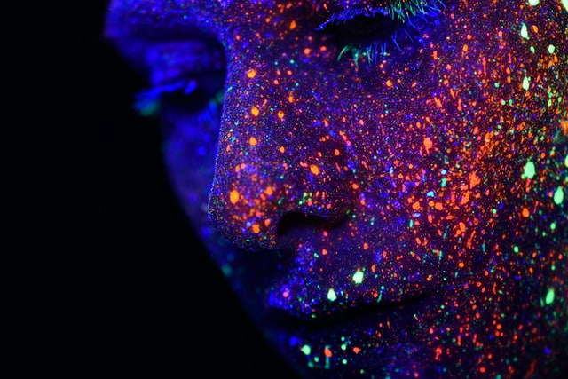

Photo by <a href="https://unsplash.com/@heyerlein?utm_source=unsplash&amp;utm_medium=referral&amp;utm_content=creditCopyText">h heyerlein</a> on <a href="https://unsplash.com/s/photos/machine-learning?utm_source=unsplash&amp;utm_medium=referral&amp;utm_content=creditCopyText">Unsplash</a>

### Overview

* Facial expression recognition software is a technology which uses biometric markers to detect emotions in human faces. 
* More precisely, this technology is a sentiment analysis tool and is able to automatically detect the six basic or universal expressions: happiness, sadness, anger, neutral,  surprise, fear, and disgust.
* Facial expressions and other gestures convey nonverbal communication cues that play an important role in interpersonal relations.
* Therefore, facial expression recognition, because it extracts and analyzes information from an image or video feed, it is able to deliver unfiltered, unbiased emotional responses as data.

## Built With

* [Python](https://www.python.org/)
* [Jupyter Notebook](https://jupyter.org/)
* [Google Colab](https://colab.research.google.com/)

### Problem Statement

* Given a data set consisting of facial images and their sketches, retrieve all images (real and /or sketch) which are similar to the given test image, along with various attributes of the image such as gender, expression and so on. 

### Data Source

* The dataset was collected by us, consisting of 60 university students. 
* Total images = 60 * 7(happiness, sadness, anger, neutral,  surprise, fear, and disgust).

### Plan

* Face Detection - Locating faces in the scene, in an image or video footage. 
* Facial Landmark Detection - Extracting information about facial features from the detected faces. 
* Facial Expression And Emotion Classification - Classifying the obtained information into expression interpretative categories such as smile or frown or emotion categories such as happy, anger, disgust etc.  

## Approach

### Data Cleaning

* After importing the images, the images were resized to 420 × 240 because some of the images in the dataset did not have 1280 × 960 as their size, despite the submission format.

### Data Preprocessing 

* The images were then converted into grayscale to remove the third dimension and to make the implementation easier.
* Then the images were then flattened (except for CNN) and for Neural Network we have applied PCA to reduce image’s dimensions.
* Histogram of oriented gradients was used to extract faces from entire images. 
* Then the dataset was divided into two parts 90% of the dataset was used for training and rest 10% was used for testing.

### Data Augmentation

* We have used data augmentation to increase size of our dataset.

### Learning Algorithms 

* We have taken two types of approaches:
  * Non-neural network approach 
    * K Nearest Neighbours (with k = 5, minkowski distance with p = 2)
    * Support Vector Machine (linear kernel)
    * Naive Bayes (Gaussian with variance 10^-9)
    * Decision Tree
    * Random Forest (n = 10)
  * Neural network approach
    * Back propagation Neural Network (with 15 features and 2 layers)
    * Convolutional Neural Network (3 convolutional layers and 2 fully connected layers with pooling layers)

## Results

* Convolutional Neural Network Summary

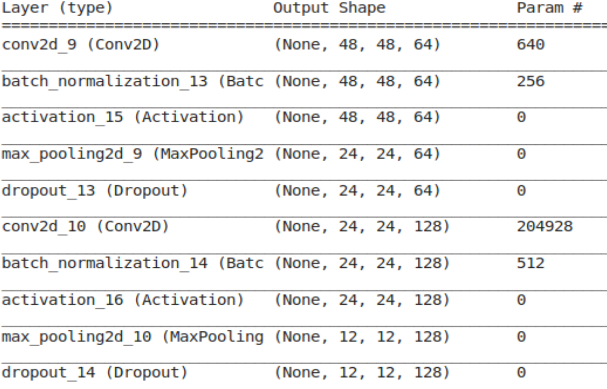

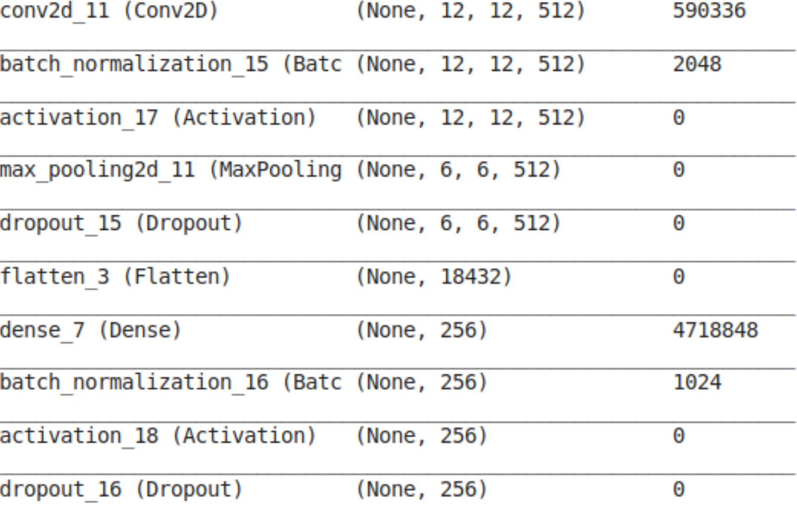

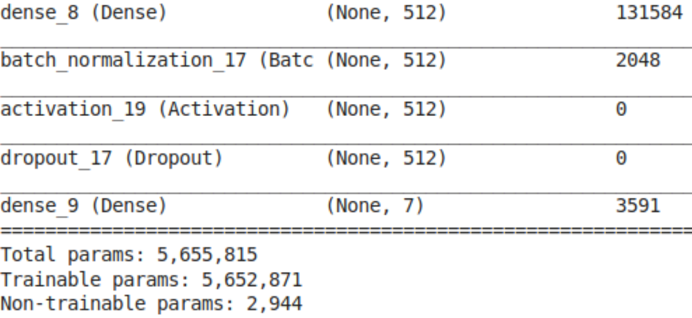

* Visualization of Weights of Different Filters (Emotion Recognition)

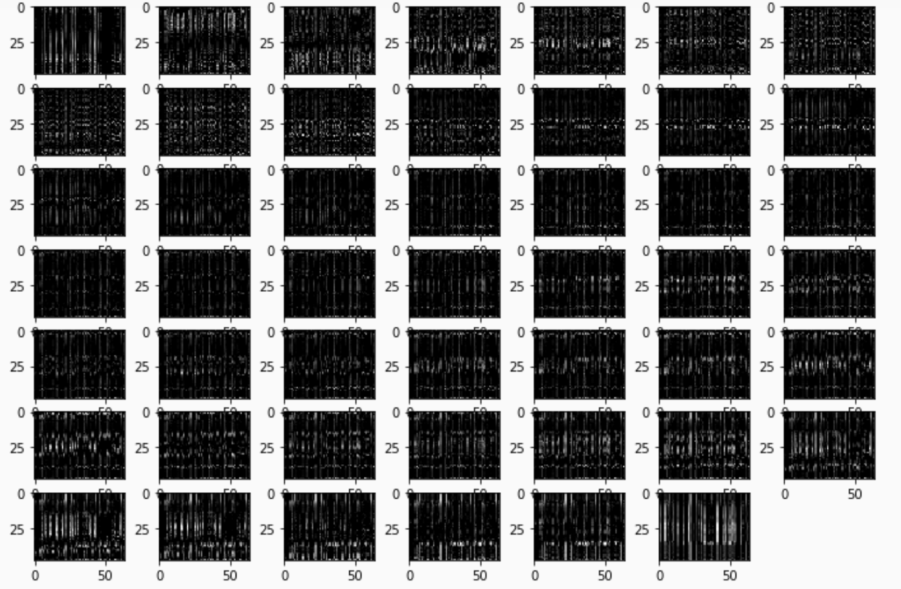

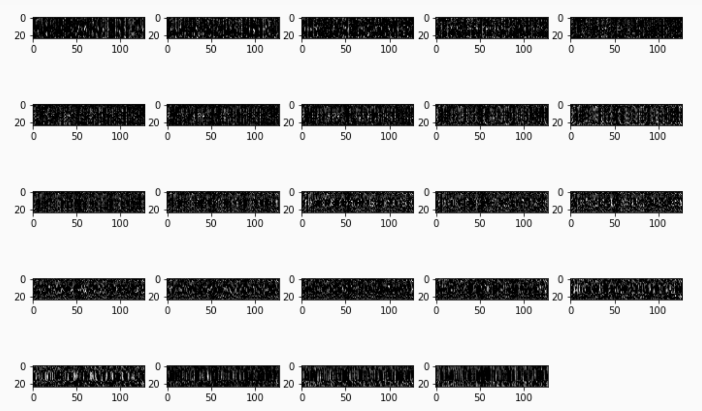

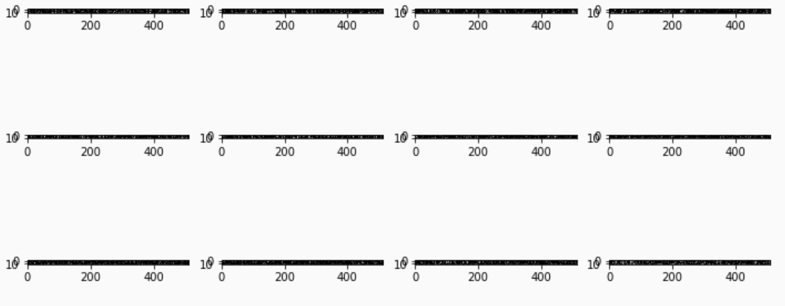

* Confusion Matrix for CNN

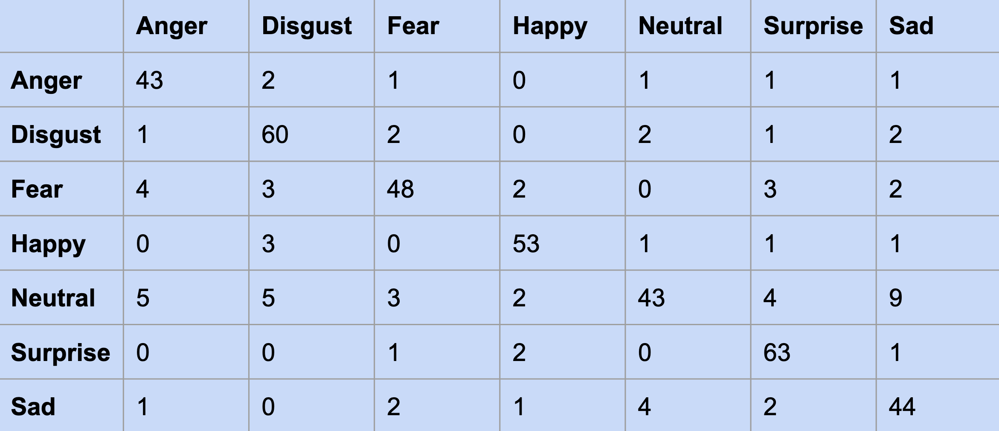

* Misclassified Images

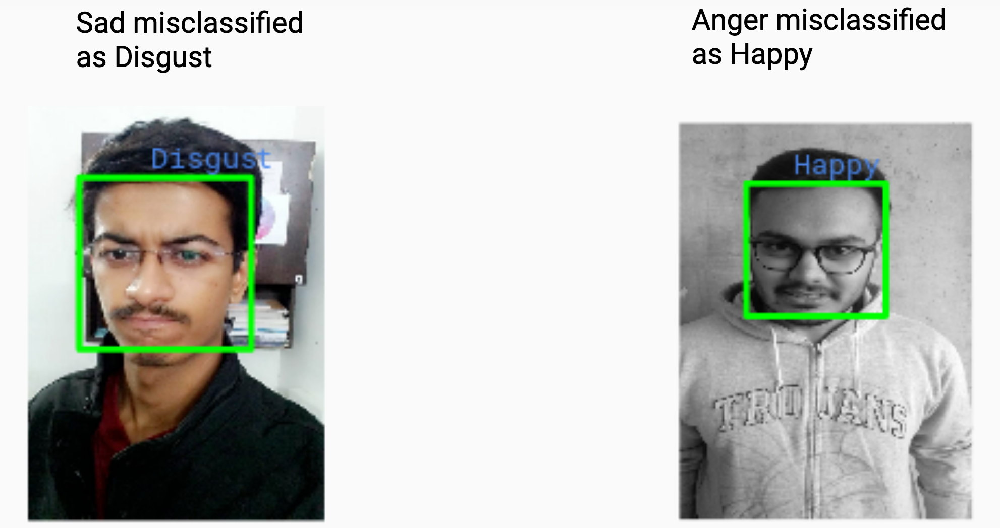

* Accuracy for Face Recognition 

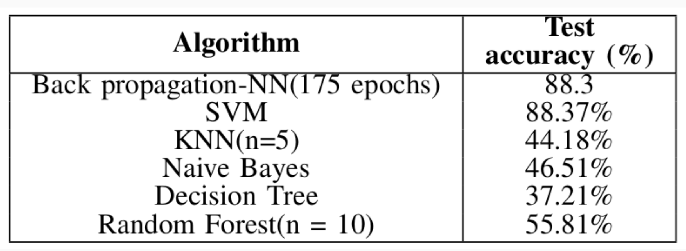

* Accuracy for Gender Recognition 

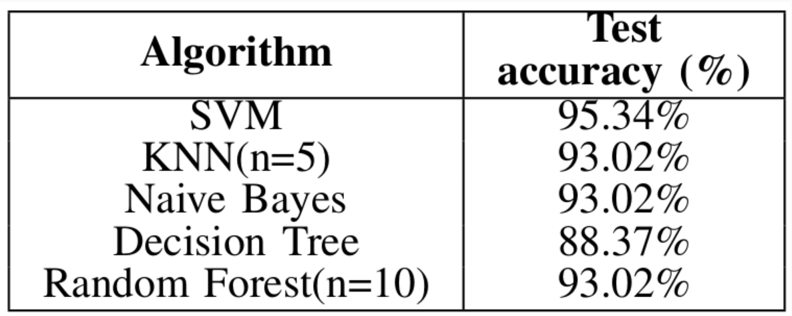

* Accuracy for Expression Recognition 

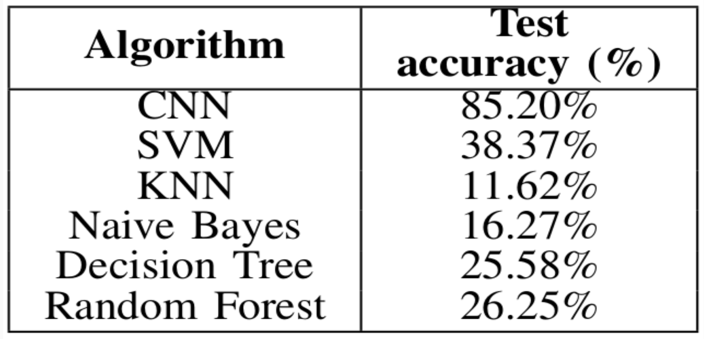

<!-- CONTRIBUTING -->
## Contributing  

Any contributions you make are **greatly appreciated**.

1. Fork the Project
2. Create your Feature Branch (`git checkout -b feature/amazing-feature`)
3. Commit your Changes (`git commit -m 'feat: some amazing feature'`)
4. Push to the Branch (`git push origin feature/amazing-feature`)
5. Open a Pull Request

<!-- LICENSE -->
## License

Distributed under the MIT License. See `LICENSE` for more information.

<!-- CONTACT -->
## Contact

* Team:
  * [Maharsh Suryawala](https://www.linkedin.com/in/maharsh-suryawala/)
  * [Nikhil Balwani](https://www.linkedin.com/in/nikhilbalwani/)
  * [Parshwa Shah](https://www.linkedin.com/in/parshwa1999/)

## References

* Sharif M., Mohsin S., Hanan R., Javed M. and Raza M., ”Using nose Heuristics for Efficient face Recognition”, Sindh Univ. Res. Jour. (Sci. Ser.) Vol.43 (1-A), 63-68,(2011)
* Maryam Murtaza, Muhammad Sharif, Mudassar Raza, Jamal Hussain Shah, “Analysis of Face Recognition under Varying Facial Expression: A Survey”, The International Arab Journal of Information Technology (IAJIT) Volume 10, No.4 , July 2013
* https://medium.com/neurohive-computer-vision/state-of-the-art-facial-expression-recognition-model-introducing-of-covariances-9718c3cca996/
* https://www.pyimagesearch.com/2018/06/18/face-recognition-with-opencv-python-and-deep-learning/ 

<!-- ACKNOWLEDGEMENTS -->
## Acknowledgements
* [Img Shields](https://shields.io)
* [Iconify](https://iconify.design/)
* [MIT License](https://opensource.org/licenses/MIT)
* [Unsplash](https://unsplash.com/)
* [Badgen](https://badgen.net/)
* [For The Badge](https://forthebadge.com/)

<!-- MARKDOWN LINKS -->
<!-- https://www.markdownguide.org/basic-syntax/#reference-style-links -->
[contributors-shield]: https://img.shields.io/github/contributors/MaharshSuryawala/Face-Detection-and-Facial-Expression-Recognition?style=flat-square 
[contributors-url]: https://github.com/MaharshSuryawala/Face-Detection-and-Facial-Expression-Recognition/graphs/contributors
[license-shield]: https://img.shields.io/github/license/MaharshSuryawala/Face-Detection-and-Facial-Expression-Recognition?style=flat-square?style=flat-square
[license-url]: https://github.com/MaharshSuryawala/Face-Detection-and-Facial-Expression-Recognition?style=flat-square/blob/master/LICENSE.txt
